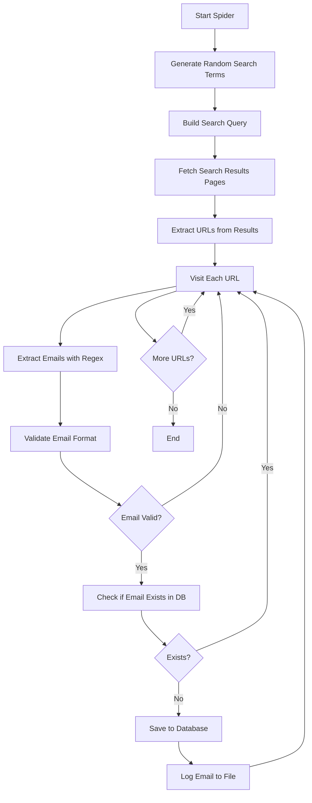

# Instructions

## Setup Instructions

1. Open the project in Visual Studio (2012 or later recommended)
2. Restore NuGet packages if needed
3. Configure SQL Server connection strings in `Web.config` files
4. Set up the database schema using the provided stored procedures

## Database Configuration

1. Create a SQL Server database for the project
2. Update connection strings in `Web.config` files across different spider projects
3. Run the database schema creation scripts (if available)
4. Ensure proper permissions for the application to read/write to the database

### Database Setup Example

```sql
-- Create database
CREATE DATABASE CVSpiderDB;
GO

-- Create email storage table
USE CVSpiderDB;
GO

CREATE TABLE CVMails (
    ID INT PRIMARY KEY IDENTITY(1,1),
    Mail NVARCHAR(255) NOT NULL UNIQUE,
    DateCreated DATETIME DEFAULT GETDATE()
);
GO
```

## Project Structure

The repository contains multiple spider implementations:

### CVSpider
ASP.NET Web Application with HTTP handler for spider operations
- `Spider.ashx.cs`: Main spider logic for searching and extracting emails
- `Code/BLL.cs`: Business logic layer
- `Code/DAL.cs`: Data access layer
- `Code/TextUtils.cs`: Text processing utilities
- `Code/EmailRow.cs`: Email data model
- `Code/Cities.cs`: City name generator
- `Code/Professions.cs`: Profession name generator
- `Code/MailTypes.cs`: Email type generator

### CVConsole
Console application version of the spider for batch processing

### CV1, CV2, CV3, CV4
Various iterations of web-based spiders with different approaches
- jQuery-based automation
- AJAX polling for status updates
- Timer-based execution tracking

### CVNew, CVNewFinal
Refined versions with improved architecture

### Spider
Standalone spider implementation

## Running the Spiders

### Web-Based Spiders (CV2, CV3, etc.)

1. Open the solution in Visual Studio
2. Set the web project as the startup project
3. Press F5 to run with debugging
4. Navigate to the appropriate `.aspx` page (e.g., `WallaSearch.aspx`)
5. The spider will automatically start based on the configured action type

### HTTP Handler Spiders (CVSpider)

1. Open `CVSpider.sln` in Visual Studio
2. Update configuration in `Spider.ashx.cs`:
   ```csharp
   string actionType = "search"; // or "print"
   string mainPath = @"C:\Your\Log\Path\";
   ```
3. Run the application
4. Access the handler: `http://localhost:port/Spider.ashx`

### Console Spiders (CVConsole)

1. Open `CVConsole.sln` in Visual Studio
2. Update configuration in the main program file
3. Build the project (Ctrl+Shift+B)
4. Run the executable from `bin/Debug/CVSpider.exe`

## Configuration Options

### Spider Settings

Edit the spider handler or page code to configure:

```csharp
// Search parameters
string city = Cities.GetRandomCity();
string profession = Professions.GetRandomProfession();
string mailType = MailTypes.GetRandomMailType();

// Query construction
string querySearch = string.Format($"דרוש/ה+{profession}+ב{city}+{mailType}");

// Pagination
for (int i = 10; i > 1; i--)
{
    // Process pages
}
```

### Retry Logic

```csharp
int maxRetries = 10;
int retriesCount = 0;
bool success = false;
while (!success && retriesCount < maxRetries)
{
    // Attempt operation
}
```

### Log File Paths

Update log file paths in the code:
```csharp
string mainPath = @"C:\Or\Web\CVSpider\CVSpider\CVSpider\CVSpider\Logs\";
```

## Email Extraction Process

### Search Flow



### Email Validation

The spider validates emails by:
1. Checking for presence of `@` symbol
2. Filtering out image files (`.jpg`, `.png`)
3. Ensuring minimum length for both parts of the email
4. Cleaning common email format issues
5. Checking for duplicates in the database

## Output

### Database Storage

Emails are stored in the SQL Server database with:
- Unique constraint to prevent duplicates
- Timestamp for tracking when the email was found
- Sequential ID for reference

### Log Files

Spider activity is logged to text files:
- `mails.txt`: Primary log file for discovered emails
- `mails1.txt`: Backup log file
- Date-stamped log files in the `Logs/` directory

## Important Notes

### Legal and Ethical Considerations

- **Respect robots.txt**: Check target website robots.txt files before scraping
- **Terms of Service**: Ensure compliance with website terms of service
- **Rate Limiting**: Implement delays between requests to avoid server overload
- **Data Privacy**: Handle collected data responsibly and in compliance with privacy laws (GDPR, CCPA)
- **Consent**: Only use collected emails for legitimate purposes with proper consent

### Technical Considerations

- The spiders target Hebrew language job search websites (Walla, etc.)
- HTML structure changes on target sites may break the scrapers
- Regular expression patterns may need updates as website formats change
- Database connection pooling is handled by .NET Framework
- UTF-8 encoding is required for proper Hebrew text handling

### Maintenance

- Regularly test spider functionality against target websites
- Update regex patterns when website structures change
- Monitor log files for errors and issues
- Clean up database periodically to remove invalid emails
- Review and update email validation rules as needed

## Troubleshooting

### Common Issues

1. **Connection String Errors**
   - Verify SQL Server connection string in `Web.config`
   - Ensure SQL Server is running and accessible

2. **Regex Pattern Failures**
   - Test regex patterns with current website HTML
   - Update patterns if website structure has changed

3. **Email Validation Issues**
   - Review `ValidateMail()` function logic
   - Check `ClearEmail()` function for edge cases

4. **Database Insert Failures**
   - Check for duplicate email constraint violations
   - Verify database permissions
   - Review retry logic implementation

5. **Website Access Issues**
   - Check internet connectivity
   - Verify target website is accessible
   - Check for IP blocking or rate limiting

## Author

* **Or Assayag** - *Initial work* - [orassayag](https://github.com/orassayag)
* Or Assayag <orassayag@gmail.com>
* GitHub: https://github.com/orassayag
* StackOverflow: https://stackoverflow.com/users/4442606/or-assayag?tab=profile
* LinkedIn: https://linkedin.com/in/orassayag
