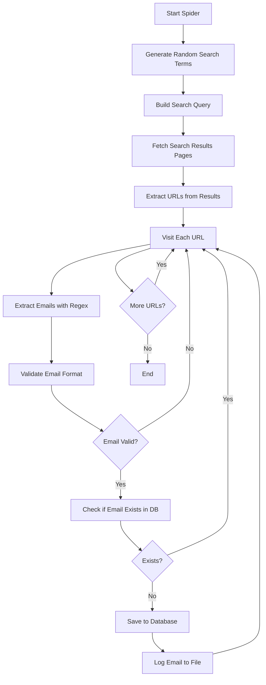

# Setup and Usage Instructions

## Table of Contents

1. [Prerequisites](#prerequisites)
2. [Initial Setup](#initial-setup)
3. [Install Dependencies](#install-dependencies)
4. [Database Configuration](#database-configuration)
5. [Available Commands](#available-commands)
6. [Running Scripts](#running-scripts)
7. [Project Structure](#project-structure)
8. [Email Extraction Process](#email-extraction-process)
9. [Output](#output)
10. [Troubleshooting](#troubleshooting)
11. [Best Practices](#best-practices)
12. [Extending the Application](#extending-the-application)
13. [Documentation](#documentation)
14. [External Resources](#external-resources)

## Prerequisites

### System Requirements

- **.NET Framework**: Version 4.0 or higher (4.5+ recommended)
- **IDE**: Visual Studio 2012 or later (2015/2017 recommended)
- **Database**: SQL Server 2012 or later (SQL Server 2014/2016 recommended)
- **Database Management**: SQL Server Management Studio (SSMS)
- **Operating System**: Windows (7 or later)

### Knowledge Prerequisites

- Basic understanding of ASP.NET Web Forms
- Familiarity with SQL Server and database management
- Understanding of C# and .NET Framework
- Basic knowledge of regular expressions (helpful but not required)

## Initial Setup

1. Clone the repository:

```bash
git clone https://github.com/orassayag/dot-net-spiders.git
cd dot-net-spiders
```

2. Open the project in Visual Studio (2012 or later recommended)

## Install Dependencies

1. Restore NuGet packages (if needed):
   - Right-click on the solution in Visual Studio
   - Select "Restore NuGet Packages"

2. Ensure .NET Framework 4.0+ is installed on your system

## Database Configuration

1. Create a SQL Server database for the project
2. Update connection strings in `Web.config` files across different spider projects
3. Run the database schema creation script (see below)
4. Ensure proper permissions for the application to read/write to the database

### Database Setup Example

```sql
-- Create database
CREATE DATABASE CVSpiderDB;
GO

-- Create email storage table
USE CVSpiderDB;
GO

CREATE TABLE CVMails (
    ID INT PRIMARY KEY IDENTITY(1,1),
    Mail NVARCHAR(255) NOT NULL UNIQUE,
    DateCreated DATETIME DEFAULT GETDATE()
);
GO
```

### Update Connection Strings

In each project's `Web.config` or `App.config`:

```xml
<connectionStrings>
    <add name="CVSpiderConnectionString"
         connectionString="Data Source=YOUR_SERVER;Initial Catalog=CVSpiderDB;Integrated Security=True"
         providerName="System.Data.SqlClient" />
</connectionStrings>
```

## Project Structure

The repository contains multiple spider implementations:

### CVSpider
ASP.NET Web Application with HTTP handler for spider operations
- `Spider.ashx.cs`: Main spider logic for searching and extracting emails
- `Code/BLL.cs`: Business logic layer
- `Code/DAL.cs`: Data access layer
- `Code/TextUtils.cs`: Text processing utilities
- `Code/EmailRow.cs`: Email data model
- `Code/Cities.cs`: City name generator
- `Code/Professions.cs`: Profession name generator
- `Code/MailTypes.cs`: Email type generator

### CVConsole
Console application version of the spider for batch processing

### CV1, CV2, CV3, CV4
Various iterations of web-based spiders with different approaches
- jQuery-based automation
- AJAX polling for status updates
- Timer-based execution tracking

### CVNew, CVNewFinal
Refined versions with improved architecture

### Spider
Standalone spider implementation

## Available Commands

### Development Commands

**Build Solution:**
- Press `Ctrl+Shift+B` in Visual Studio
- Or use: Build → Build Solution

**Clean Solution:**
- Build → Clean Solution
- Then rebuild

**Debug Web Project:**
1. Set web project as startup
2. Press `F5` to debug
3. Set breakpoints in code

**Debug Console Project:**
1. Set console project as startup
2. Press `F5` to debug

## Running Scripts

### Web-Based Spiders (CV2, CV3, etc.)

1. Open the solution in Visual Studio
2. Set the web project as the startup project
3. Press F5 to run with debugging
4. Navigate to the appropriate `.aspx` page (e.g., `WallaSearch.aspx`)
5. The spider will automatically start based on the configured action type

### HTTP Handler Spiders (CVSpider)

1. Open `CVSpider.sln` in Visual Studio
2. Update configuration in `Spider.ashx.cs`:
   ```csharp
   string actionType = "search"; // or "print"
   string mainPath = @"C:\Your\Log\Path\";
   ```
3. Run the application
4. Access the handler: `http://localhost:port/Spider.ashx`

### Console Spiders (CVConsole)

1. Open `CVConsole.sln` in Visual Studio
2. Update configuration in the main program file
3. Build the project (Ctrl+Shift+B)
4. Run the executable from `bin/Debug/CVSpider.exe`

## Configuration Options

### Spider Settings

Edit the spider handler or page code to configure:

```csharp
// Search parameters
string city = Cities.GetRandomCity();
string profession = Professions.GetRandomProfession();
string mailType = MailTypes.GetRandomMailType();

// Query construction
string querySearch = string.Format($"דרוש/ה+{profession}+ב{city}+{mailType}");

// Pagination
for (int i = 10; i > 1; i--)
{
    // Process pages
}
```

### Retry Logic

```csharp
int maxRetries = 10;
int retriesCount = 0;
bool success = false;
while (!success && retriesCount < maxRetries)
{
    // Attempt operation
}
```

### Log File Paths

Update log file paths in the code:
```csharp
string mainPath = @"C:\Or\Web\CVSpider\CVSpider\CVSpider\CVSpider\Logs\";
```

## Email Extraction Process

### Search Flow


```mermaid
graph TD
    A[Start Spider] --> B[Generate Random Search Terms]
    B --> C[Build Search Query]
    C --> D[Fetch Search Results Pages]
    D --> E[Extract URLs from Results]
    E --> F[Visit Each URL]
    F --> G[Extract Emails with Regex]
    G --> H[Validate Email Format]
    H --> I{Email Valid?}
    I -->|Yes| J[Check if Email Exists in DB]
    I -->|No| F
    J --> K{Exists?}
    K -->|No| L[Save to Database]
    K -->|Yes| F
    L --> M[Log Email to File]
    M --> F
    F --> N{More URLs?}
    N -->|Yes| F
    N -->|No| O[End]
```

### Email Validation

The spider validates emails by:
1. Checking for presence of `@` symbol
2. Filtering out image files (`.jpg`, `.png`)
3. Ensuring minimum length for both parts of the email
4. Cleaning common email format issues
5. Checking for duplicates in the database

## Output

### Database Storage

Emails are stored in the SQL Server database with:
- Unique constraint to prevent duplicates
- Timestamp for tracking when the email was found
- Sequential ID for reference

### Log Files

Spider activity is logged to text files:
- `mails.txt`: Primary log file for discovered emails
- `mails1.txt`: Backup log file
- Date-stamped log files in the `Logs/` directory

## Troubleshooting

### Common Issues

1. **Connection String Errors**
   - Verify SQL Server connection string in `Web.config`
   - Ensure SQL Server is running and accessible

2. **Regex Pattern Failures**
   - Test regex patterns with current website HTML
   - Update patterns if website structure has changed

3. **Email Validation Issues**
   - Review `ValidateMail()` function logic
   - Check `ClearEmail()` function for edge cases

4. **Database Insert Failures**
   - Check for duplicate email constraint violations
   - Verify database permissions
   - Review retry logic implementation

5. **Website Access Issues**
   - Check internet connectivity
   - Verify target website is accessible
   - Check for IP blocking or rate limiting

## Best Practices

### Before Running Spiders

1. **Test with Small Queries**: Start with limited pages to verify functionality
2. **Respect Robots.txt**: Check target website crawling policies
3. **Rate Limiting**: Implement delays between requests to avoid overwhelming servers
4. **Database Backup**: Backup your database before large operations
5. **Monitor Logs**: Check log files for errors and issues

### Data Quality

1. **Clean Extracted Emails**: Use the built-in `ClearEmail()` function
2. **Validate Before Storage**: Always validate emails before saving
3. **Handle Duplicates**: Use database unique constraints to prevent duplicates
4. **Log Everything**: Keep detailed logs for debugging and monitoring

### Operational Best Practices

1. **Regular Maintenance**:
   - Clean old logs periodically
   - Review and clean the database
   - Update dependencies if needed

2. **Monitoring**:
   - Check log files for errors
   - Monitor database size
   - Verify spider functionality regularly

3. **Security**:
   - Never commit sensitive data (connection strings, etc.)
   - Use appropriate database permissions
   - Secure log files

4. **Ethics**:
   - Respect website terms of service
   - Use only for legitimate purposes with proper consent
   - Handle collected data responsibly and comply with privacy laws

## Extending the Application

### Adding New Search Terms

To add new cities, professions, or email types:

1. Edit the respective files in `Code/`:
   - `Cities.cs` for new cities
   - `Professions.cs` for new professions
   - `MailTypes.cs` for new email types

2. Rebuild the solution

### Creating New Spider Variants

1. Create a new project in Visual Studio
2. Copy the relevant files from an existing spider
3. Modify the logic as needed
4. Update the connection string and configuration
5. Build and test

## Documentation

- [README.md](README.md) - Project overview and features
- [CONTRIBUTING.md](CONTRIBUTING.md) - Contribution guidelines
- [CHANGELOG.md](CHANGELOG.md) - Version history

## External Resources

- [ASP.NET Web Forms Documentation](https://learn.microsoft.com/en-us/aspnet/web-forms/)
- [LINQ to SQL Documentation](https://learn.microsoft.com/en-us/dotnet/framework/data/adonet/sql/linq/)
- [SQL Server Documentation](https://learn.microsoft.com/en-us/sql/)
- [C# Regular Expressions](https://learn.microsoft.com/en-us/dotnet/standard/base-types/regular-expressions)
- [jQuery Documentation](https://jquery.com/)

## Important Notes

### Legal and Ethical Considerations

- **Respect robots.txt**: Check target website robots.txt files before scraping
- **Terms of Service**: Ensure compliance with website terms of service
- **Rate Limiting**: Implement delays between requests to avoid server overload
- **Data Privacy**: Handle collected data responsibly and in compliance with privacy laws (GDPR, CCPA)
- **Consent**: Only use collected emails for legitimate purposes with proper consent

### Technical Considerations

- The spiders target Hebrew language job search websites (Walla, etc.)
- HTML structure changes on target sites may break the scrapers
- Regular expression patterns may need updates as website formats change
- Database connection pooling is handled by .NET Framework
- UTF-8 encoding is required for proper Hebrew text handling

### Maintenance

- Regularly test spider functionality against target websites
- Update regex patterns when website structures change
- Monitor log files for errors and issues
- Clean up database periodically to remove invalid emails
- Review and update email validation rules as needed

## Author

- **Or Assayag** - _Initial work_ - [orassayag](https://github.com/orassayag)
- Or Assayag <orassayag@gmail.com>
- GitHub: https://github.com/orassayag
- StackOverflow: https://stackoverflow.com/users/4442606/or-assayag?tab=profile
- LinkedIn: https://linkedin.com/in/orassayag

---

**Last Updated**: June 2026
**Version**: 1.0.0
