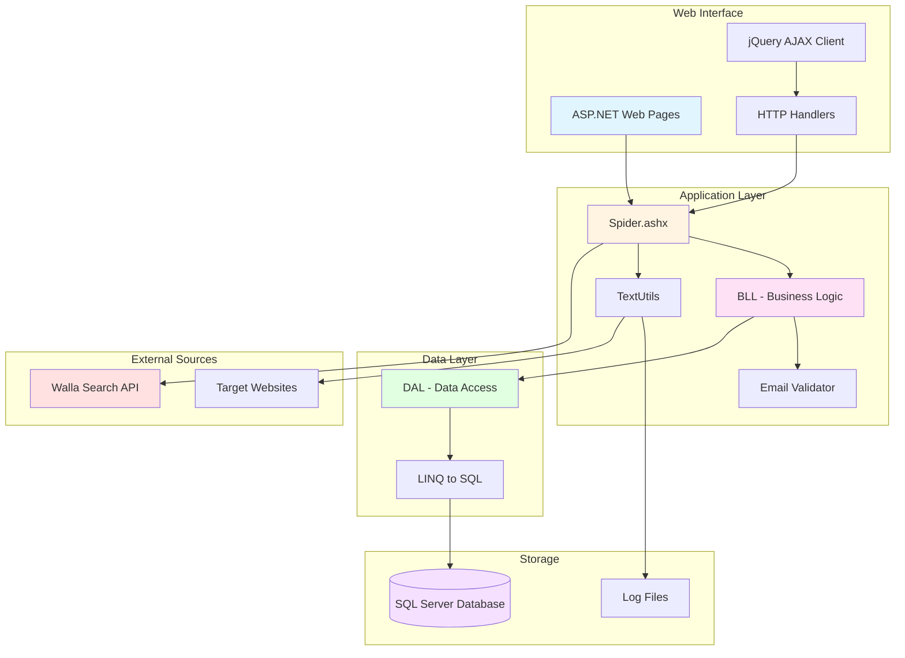
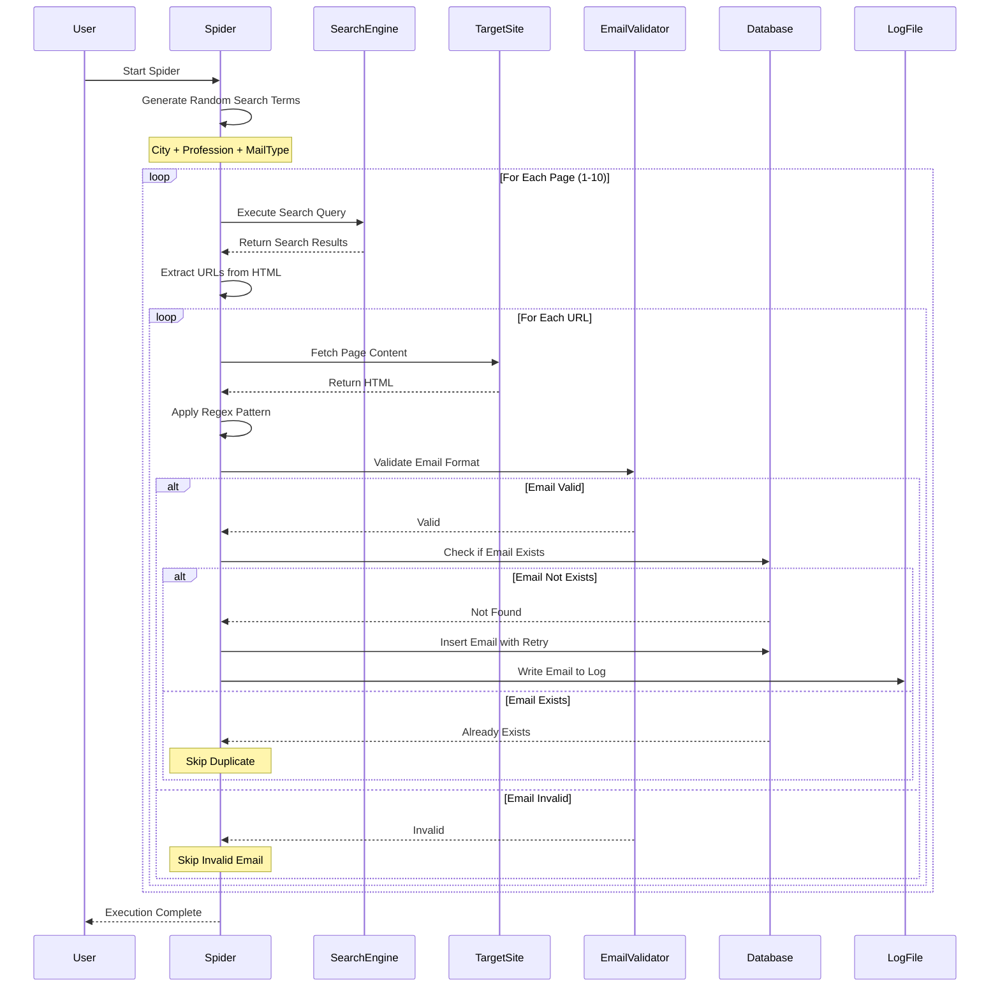

# .NET Spiders

A collection of ASP.NET web crawlers (spiders) for extracting email addresses from various online sources including job search websites, APIs, and public web pages.

Built in 2012-2016. These spiders crawl Israeli job search websites (primarily Walla Search) to extract and store email addresses for recruitment purposes, utilizing ASP.NET Web Forms, LINQ to SQL, and SQL Server.

## Features

- 🕷️ Web crawling with customizable search parameters
- 📧 Email extraction using regex patterns
- 🔍 Search query generation with cities, professions, and email types
- 💾 SQL Server database storage with duplicate prevention
- ♻️ Automatic retry logic for failed operations
- 📝 File-based logging of discovered emails
- ⏱️ Timer-based execution tracking with jQuery
- 🎲 Random search term generation for broader coverage
- 🧹 Email validation and sanitization
- 🌐 Support for Hebrew language content

## Architecture Overview



## Spider Workflow



## Getting Started

### Prerequisites

You'll need to install:
- **.NET Framework 4.0+** (or .NET Framework 4.5 for newer features)
- **Visual Studio 2012** or later (2015/2017 recommended)
- **SQL Server 2012** or later (SQL Server 2014/2016 recommended)
- **SQL Server Management Studio** (SSMS) for database management

### Installation

1. Clone the repository:
```bash
git clone https://github.com/orassayag/dot-net-spiders.git
cd dot-net-spiders
```

2. Open the solution in Visual Studio:
```bash
# For the main spider project
start CVSpider/CVSpider.sln

# Or for console version
start CVConsole/CVSpider.sln
```

3. Restore NuGet packages:
   - Right-click on the solution in Visual Studio
   - Select "Restore NuGet Packages"

4. Set up the database:
   - Open SQL Server Management Studio
   - Create a new database (e.g., `CVSpiderDB`)
   - Run the schema creation script (see INSTRUCTIONS.md)
   - Update connection strings in `Web.config` files

### Configuration

1. **Update Database Connection String** in `Web.config`:
```xml
<connectionStrings>
    <add name="CVSpiderConnectionString" 
         connectionString="Data Source=YOUR_SERVER;Initial Catalog=CVSpiderDB;Integrated Security=True" 
         providerName="System.Data.SqlClient" />
</connectionStrings>
```

2. **Configure Spider Settings** in `Spider.ashx.cs`:
```csharp
string actionType = "search"; // "search" or "print"
string mainPath = @"C:\Your\Log\Path\";
```

3. **Build the Solution**:
   - Press `Ctrl+Shift+B` in Visual Studio
   - Or use: Build → Build Solution

### Running the Spider

#### Web-Based Spider

1. Set the web project as startup project
2. Press `F5` to run with debugging
3. Navigate to `http://localhost:port/Spider.ashx` (CVSpider)
4. Or navigate to `WallaSearch.aspx` (CV2/CV3 projects)

#### Console Spider

1. Build the console project
2. Navigate to `bin/Debug/` folder
3. Run `CVSpider.exe`

## Project Structure

```
dot-net-spiders/
├── CVSpider/                    # Main HTTP handler spider
│   ├── Spider.ashx             # HTTP handler entry point
│   ├── Spider.ashx.cs          # Spider implementation
│   ├── Code/
│   │   ├── BLL.cs              # Business logic layer
│   │   ├── DAL.cs              # Data access layer
│   │   ├── TextUtils.cs        # Text processing utilities
│   │   ├── EmailRow.cs         # Email data model
│   │   ├── Cities.cs           # City generator
│   │   ├── Professions.cs      # Profession generator
│   │   └── MailTypes.cs        # Mail type generator
│   └── Web.config              # Configuration
├── CVConsole/                   # Console application version
│   └── CVSpider/
├── CV1/                         # Web spider iteration 1
├── CV2/                         # Web spider iteration 2
│   ├── WallaSearch.aspx        # Search page
│   ├── FetchMails.ashx         # Email fetcher
│   └── jquery.timer.js         # Timer utility
├── CV3/                         # Web spider iteration 3
│   ├── WallaSearch.aspx        # Enhanced search page
│   ├── NewFetchMails.ashx      # Improved fetcher
│   └── PrintMails.ashx         # Email printer
├── CV4/                         # Web spider iteration 4
├── CVNew/                       # Refactored version
├── CVNewFinal/                  # Final refactored version
├── CVConsole1/                  # Alternative console version
├── Spider/                      # Standalone spider
├── README.md
├── CONTRIBUTING.md
├── INSTRUCTIONS.md
└── LICENSE
```

## Spider Components

### Search Query Generation

The spider generates search queries by combining:
- **Cities**: Random Israeli cities (Jerusalem, Tel Aviv, Haifa, etc.)
- **Professions**: Job titles (Engineer, Developer, Manager, etc.)
- **Mail Types**: Email domains (gmail.com, walla.co.il, etc.)

Example query:
```
דרוש/ה+מהנדס+בתל-אביב+@gmail.com
```

### Email Extraction

Uses regex pattern to extract emails:
```csharp
Regex emailRegex = new Regex(
    @"[a-z0-9!#$%&'*+/=?^_`{|}~-]+(?:\.[a-z0-9!#$%&'*+/=?^_`{|}~-]+)*@(?:[a-z0-9](?:[a-z0-9-]*[a-z0-9])?\.)+[a-z0-9](?:[a-z0-9-]*[a-z0-9])?"
);
```

### Email Validation

Validates emails by:
1. Checking for `@` symbol presence
2. Filtering image files (`.jpg`, `.png`)
3. Ensuring minimum length (2+ characters per part)
4. Cleaning common format issues
5. Checking database for duplicates

### Email Cleaning

The `ClearEmail()` function fixes common issues:
- Removes special characters (`/`, `\`, `!`, `%`, etc.)
- Corrects typos (`.con` → `.com`, `.njet` → `.net`)
- Fixes domain extensions (`.co` → `.co.il`, `.ili` → `.il`)
- Removes `mailto:` prefixes
- Handles multiple dots and spaces

## Database Schema

```sql
-- Main email storage table
CREATE TABLE CVMails (
    ID INT PRIMARY KEY IDENTITY(1,1),
    Mail NVARCHAR(255) NOT NULL UNIQUE,
    DateCreated DATETIME DEFAULT GETDATE(),
    LastModified DATETIME DEFAULT GETDATE()
);

-- Index for fast lookups
CREATE INDEX IX_CVMails_Mail ON CVMails(Mail);

-- Last ID tracker (used in some versions)
CREATE TABLE LastIDs (
    ID INT PRIMARY KEY,
    LastID1 BIGINT,
    LastModified DATETIME DEFAULT GETDATE()
);
```

## Built With

* [ASP.NET Web Forms](https://www.asp.net/web-forms) - Web framework
* [LINQ to SQL](https://docs.microsoft.com/en-us/dotnet/framework/data/adonet/sql/linq/) - ORM for database operations
* [SQL Server](https://azure.microsoft.com/en-us/services/sql-database/) - Database engine
* [jQuery](https://jquery.com/) - JavaScript library for UI interactions
* [C# Regular Expressions](https://docs.microsoft.com/en-us/dotnet/standard/base-types/regular-expressions) - Pattern matching
* [Git](https://git-scm.com/) - Source control

## Usage Examples

### Starting a Search

```csharp
// Configure search parameters
string city = Cities.GetRandomCity();
string profession = Professions.GetRandomProfession();
string mailType = MailTypes.GetRandomMailType();

// Build and execute query
string querySearch = string.Format($"דרוש/ה+{profession}+ב{city}+{mailType}");
SearchMails();
```

### Extracting Emails from a Page

```csharp
private void GetMails(string url)
{
    string pageSource = TextUtils.GetPageSource(url);
    Regex emailRegex = new Regex(@"[email pattern]");
    
    foreach (Match match in emailRegex.Matches(pageSource))
    {
        if (TextUtils.ValidateMail(match.Value))
        {
            string email = match.Value.Trim().ToLower();
            CreateEmail(email);
        }
    }
}
```

### Saving to Database

```csharp
private void CreateEmail(string email)
{
    int maxRetries = 10;
    int retriesCount = 0;
    bool success = false;
    
    while (!success && retriesCount < maxRetries)
    {
        try
        {
            retriesCount++;
            BLL.CreateEmail(email);
            success = true;
        }
        catch (Exception) { }
    }
}
```

## Important Legal Notes

⚠️ **This project is for educational and archival purposes only.**

- **Respect website terms of service**: Always check and comply with target website ToS
- **Follow robots.txt**: Respect website crawling policies
- **Rate limiting**: Implement delays to avoid overwhelming servers
- **Data privacy**: Handle collected data responsibly and comply with GDPR, CCPA, and other privacy laws
- **Ethical use**: Only use for legitimate purposes with proper consent
- **No warranty**: This software is provided as-is without any guarantees

## Contributing

Contributions are welcome! Please read [CONTRIBUTING.md](CONTRIBUTING.md) for details on the code of conduct and the process for submitting pull requests.

## Versioning

We use [SemVer](http://semver.org) for versioning. For the versions available, see the [tags on this repository](https://github.com/orassayag/dot-net-spiders/tags).

## Author

* **Or Assayag** - *Initial work* - [orassayag](https://github.com/orassayag)
* Or Assayag <orassayag@gmail.com>
* GitHub: https://github.com/orassayag
* StackOverflow: https://stackoverflow.com/users/4442606/or-assayag?tab=profile
* LinkedIn: https://linkedin.com/in/orassayag

## License

This project is licensed under the MIT License - see the [LICENSE](LICENSE) file for details.

## Acknowledgments

- Built during 2012-2016 as a learning project for ASP.NET and web scraping
- Demonstrates web crawling, regex pattern matching, and database operations
- Serves as an educational example of .NET Framework web technologies
- Thanks to the open-source community for tools and libraries

## Disclaimer

This project was created for educational purposes to demonstrate web scraping and data extraction techniques. Users are responsible for ensuring their use complies with all applicable laws, regulations, and website terms of service. The author assumes no liability for misuse of this software.
